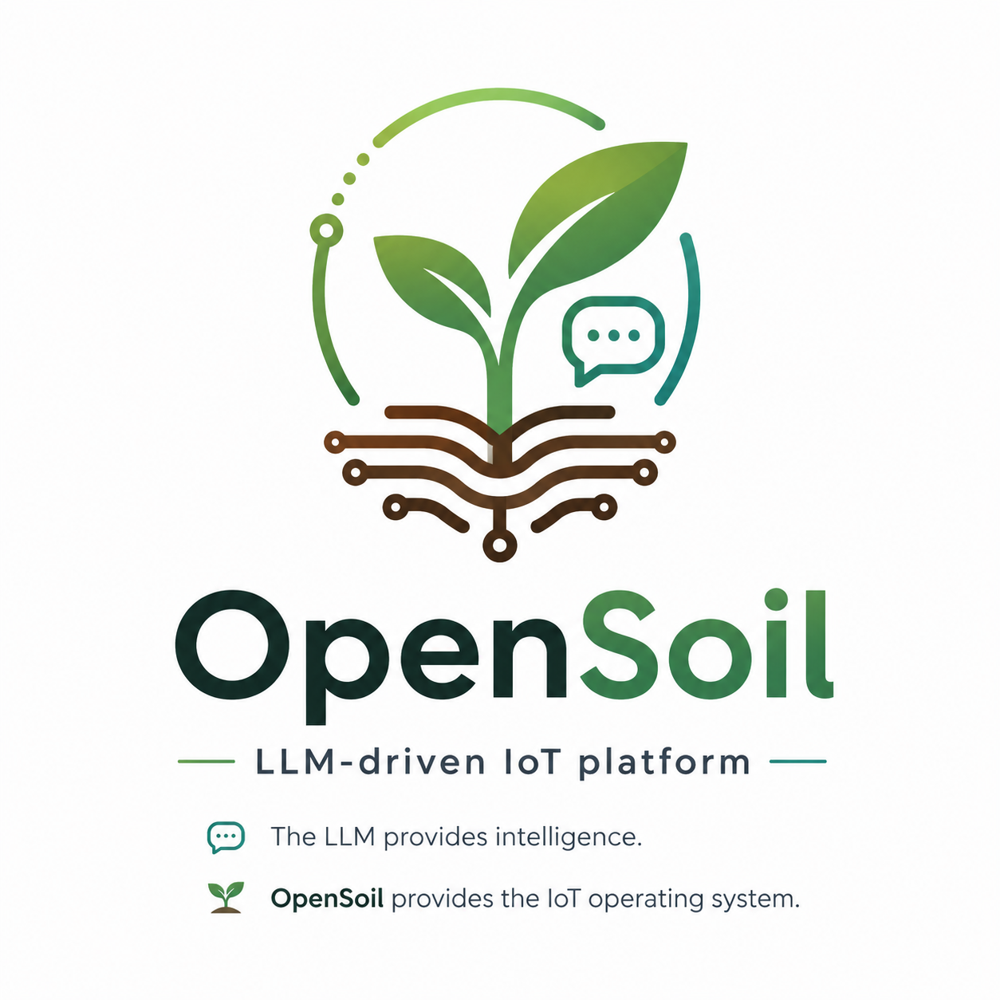

# OpenSoil

**LLM-driven IoT platform.** The LLM provides intelligence; OpenSoil provides the IoT operating system.

<p align="center">
  
</p>

Reads sensors → assembles context → calls LLM → validates safety → actuates. Every 60 seconds. Forever.

```
sensors → MQTT → orchestrator → [reflection engine] → [context assembler] → LLM → [safety engine] → actuators
                                       ↑  (every 6h)          ↑                         ↓
                                  history store ←─────────────────────────── decision log
```

---

## Quick start (Swiss chard garden box)

```bash
git clone https://github.com/opensoil/opensoil
cd opensoil
pip install -e ".[dev]"

# Edit config — swap plant, device, LLM provider as needed
cp config.example.yaml config.yaml
nano config.yaml

# Validate everything loads
opensoil validate

# Start
opensoil start
```

---

## Five plugin types — contribute any without touching core

| Plugin | What it does | Min required |
|---|---|---|
| **Sensor** | Maps a hardware sensor to an MQTT topic | `sensor.yaml` |
| **Actuator** | Maps a relay/PWM output with safety interlocks | `actuator.yaml` |
| **Device adapter** | Implements `read()` / `write()` for a hardware platform | `device.yaml` + `adapter.py` |
| **Domain** | Defines sensors, actuators, safety rules, and LLM prompt for one IoT use case | `domain.yaml` + `prompt.md` |
| **History backend** | Storage target for sensor time series and events | `backend.yaml` + `backend.py` |

See [CONTRIBUTING.md](CONTRIBUTING.md) for how to write each type.

---

## Reference implementations

| Domain | Profile | Hardware | Status |
|---|---|---|---|
| Smart garden | Swiss chard, bok choy, Thai basil | ESP32 + MQTT | ✅ included |
| Smart home | - | ESP32 / Zigbee | ✅ included |
| Aquarium | - | ESP32 + MQTT | 🚧 planned |

---

## Hardware support

| Device | Transport | Status |
|---|---|---|
| ESP32 / ESP8266 (ESPHome or Arduino) | MQTT | ✅ included |
| Multiple ESP boards (multi-node) | MQTT | ✅ included |
| Raspberry Pi | Direct GPIO | 🚧 planned |
| Arduino | Serial / USB | 🚧 planned |
| Zigbee (via coordinator) | Zigbee2MQTT | 🚧 planned |

---

## LLM providers

```yaml
llm:
  provider: claude     # Anthropic — best reasoning
  provider: gemini     # Google Gemini — generous free tier
  provider: ollama     # Local — zero cost, private (llama3.2:3b on Pi 5)
  provider: openai     # OpenAI-compatible
```

---

## CLI

```bash
opensoil start                        # Start poll loop
opensoil status                       # Last LLM decision + sensor state
opensoil history --hours 24           # Sensor history table
opensoil observe "Leaves yellowing"   # Add observation (fed to LLM)
opensoil analyze <session_id>         # Rootcause analysis (LLM post-mortem)
opensoil plugins                      # List all loaded plugins
opensoil validate                     # Check config + plugins
```

---

## Architecture

Inspired by OpenClaw's plugin system and context assembly pattern.
Extended with: hardware abstraction layer, time-series history,
physical safety engine, domain profiles, and rootcause analyzer.

See [docs/architecture.md](docs/architecture.md) for full design.

---

## License

MIT
